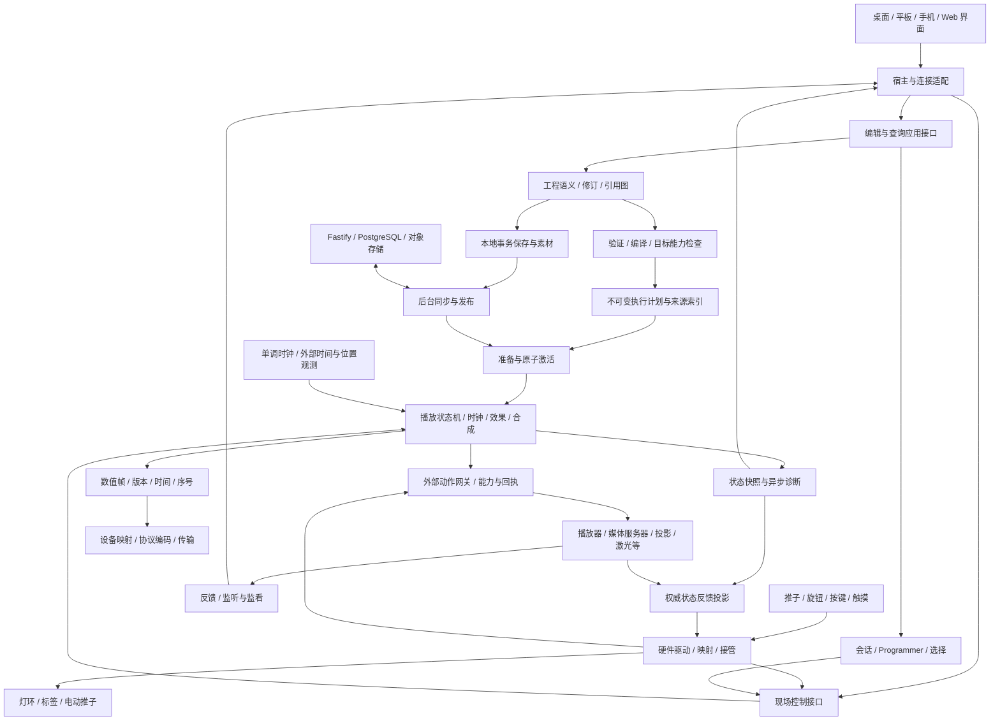

# StageMaster 架构设计 v0.6

初版日期：2026-09-11；框架定位更新：2026-10-02。状态：总体设计与分阶段实现约束，不是已实现能力或完整冻结的协议。主技术框架沿用已确认的 Rust＋TypeScript、Tauri 2＋React＋Vite、Fastify＋PostgreSQL＋对象存储。最新跨边界核对见 [ADR-097](development/decisions/PRODUCT-ADR-097-integrated-stage-platform.md)，实际进展以 [STATE](development/STATE.md) 和各工单为准；早期[代码审查](architecture-review.md)保留其原基线含义。

v0.6 明确声光电编排／现场控制、Depence 类专业预演、云端商业化和有线／无线解码器的完整产品定位，终端覆盖电脑、平板、手机及专业实体控台。各端复用工程、Rust 核心语义和应用契约，交互、宿主与渲染按能力适配。当前优先证明高返工边界，暂不继续细化局部界面；[PLAN-003](development/tasks/PLAN-003-platform-framework.md)记录本轮审查和后续验证门槛。

本设计优先明确长期难改的语义、状态归属和协议。模块可先在同一 workspace、同一进程内实现；只有故障隔离、平台能力或部署需要才拆进程。具体数据结构和算法还须通过下面的契约场景验证，不承诺以后零迁移。

v0.5 根据[完整目标再评估](architecture-evolution-review.md)解除连接／手动操作对 ActiveRun 的依赖，拆分永久配置与临时连接、工程包与执行包，明确单域激活、外部动作的同步组代次及按节点角色组装。C01—C10 记录修订与剩余验证门槛；不能把接口已改视为运行实现已完成。

用户明确核心不采用 TS 一类托管实现。[Rust／C++26 核心语言复评](core-language-rust-vs-cpp.md)继续推荐 Rust 维护工程权威语义、编译与实时执行，TS 仅承担界面／客户端和云端业务；伪 API 的 TS 声明不是引擎实现。C／C++ 可用于受边界约束的 SDK、UE 或固件，不维持两套主核心。无 GC 不能替代运行预算和实物时序验证。

媒体边界以 [ADR-052](development/decisions/PRODUCT-ADR-052-memory-and-host-audio-sync.md) 与 ADR-097 为准：基础音频可由独立宿主适配播放并正式输出，未来视频基础播放也可按能力扩展；专业混音、DSP、视频合成／映射优先外部系统。灯光核心不接收媒体大帧，节目播放、监听／监看与仿真相互独立。早期 v0.4 的“正式音视频一律外部执行”不再作为绝对限制。详见[媒体设计](audiovisual-stage-design.md)；实体控台通过[独立硬件控制面](hardware-control-surfaces.md)接入同一控制规则。

v0.3 根据[变更风险审查](architecture-change-risk-review.md)修正硬件适配范围、版本代次作用域、现场快速控制、未知扩展编辑与持久提交点。这些仍是待实现／验证的设计，不能据此认定代码已完成解耦。

模块调用面已细化为[伪 API 方案 0.3](module-api/README.md)：客户端接口与类型检查样例、Rust 内部构造与 trait、跨设备调用链、错误和资源生命周期。它是本架构的接口草案，具体服务尚未实现。

[UE5 专业预演方向](ue5-professional-previsualization.md)将专业渲染后端列为优先原型候选：复用中立场景与 Rust 已求值状态，独立准备资源和管理渲染会话；核心不依赖 UE 对象，预演不占有物理输出。其灯具匹配、资源预算与故障隔离尚待验证。

[Depence R4 对照](depence-r4-assessment.md)进一步定义节目求值、设备仿真和渲染的职责，以及外部控台独立预演、历史相关模拟的 Seek、投影／虚拟摄影机与图纸修订。仿真可按设备族采用独立后端，不能把 GPU／流体／粒子工作放进灯光输出循环；这些扩展尚未实现。

## 1. 系统边界与依赖

图中箭头表示数据流。代码依赖指向核心语义与小型契约；核心不反向依赖 UI、Tauri、Fastify、数据库、操作系统驱动或第三方档案解析器。同步模块提交包给“准备”入口，不能跳过验证直接改运行状态。

专业桌面默认设计为独立引擎宿主和 UI 客户端：UI 重启、窗口关闭或网络断开，不应隐含停止节目。无界面启动、服务生命周期、单实例与退出策略属于引擎宿主。当前 demo 尚不是该宿主。线程隔离不能承诺抵御同进程崩溃；将来需要隔离的媒体解析和插件可进入工作进程。

按编排、现场执行、控制面、监看、预演、云端／工作节点等角色组装，同机可以组合多个角色。节点只注册实际服务，连接协商对应版本和权限；聚合客户端不表示全部服务必须安装。操作会话在装载 Show 之前建立，idle 运行状态是正常状态；连接硬件、编辑或监看都不要求虚构 ActiveRun。

### 逻辑模块职责

| 模块 | 唯一负责的内容 | 主要边界 |
| --- | --- | --- |
| 基础类型与契约 | 身份、值、时间、能力、错误、消息信封 | 不包含业务巨型全局对象 |
| 灯具领域与库 | 档案版本、模式、Geometry、属性与功能描述 | 导入格式与领域模型分开 |
| 配适与设备配置 | 实例、逻辑连接、路由、校准、占用与冲突 | 逻辑灯具身份不随地址改变 |
| 工程领域 | Group、Preset、Cue、Effect、Recipe、Timeline、引用关系 | 不持有硬件句柄和现场播放进度 |
| 编辑应用服务 | 事务命令、影响预览、撤销、修订、会话 | 是修改工程的权威入口 |
| 编译与验证 | 引用解析、跟踪展开、效果计划、资源预算、来源索引 | 从工程修订生成不可变计划 |
| 执行核心 | Cue 状态机、运行时钟、事件、效果、合成 | 不遍历或修改可编辑工程 |
| 媒体执行适配 | 资源准备、基础播放、真实消费位置、输出路由和故障 | 本机／盒子／外部系统按能力部署；共享演出协调，不把解码、音视频帧送入灯光核心 |
| 外部控制与同步 | 目标目录、外部动作、只读预检、回执、时钟／位置观测 | 外部播放器／设备负责实际执行；发送与反馈不阻塞灯光帧 |
| 监听与监看 | 回传源、接收解码、仪表、本地监听、参考素材、预览流 | 不承担主节目混音、合成或正式音视频输出 |
| 硬件控制面 | 推子／旋钮／按键归一化、映射、接管和双向反馈 | 经同一语义控制网关，不直接发送 DMX 或远端厂商命令 |
| 输出 | 数值映射、DMX／网络编码、发送队列与设备状态 | 消费精简输出契约，不依赖诊断树 |
| 诊断与预览 | 来源解释、Blind／Preview、监测、录制回放 | 复用求值语义，预览无物理输出权限 |
| 设备仿真与专业渲染 | 中立场地、设备响应模型、光学表现、镜头与画面资源 | 支持独立预演角色；模型与画面不成为工程、演出时钟或输出权威 |
| 本地存储与交换 | 事务保存、恢复、迁移、素材、导入导出 | 通过领域命令／快照协作 |
| 宿主与控制接入 | Tauri、Web、本地 API、MIDI／OSC／实体控制面适配 | 输入归一化为同一命令，权限在服务端检查 |
| 共享客户端 | React 组件、布局、选择交互、客户端流程、状态投影 | 不重写 Rust 跟踪、合成和发布规则 |
| 云端与分发 | 组织／账号、权限、灯效／素材库、版本发布、设备登记、许可与审计 | Fastify 业务层；需要节目语义时复用 Rust 工作任务；不进入现场逐帧关键路径 |

这些是职责分区，不要求按表格数量建立 crate。近期先让现有 `domain/show/engine/dmx` 符合边界；需要独立编译、依赖隔离或复用时再拆 crate。`dmx` 中的档案和配适领域应移出，编码改为依赖中立的数值帧契约。

### 平台适配与目标能力

终端角色与部署硬件分别选择：电脑、平板、手机可按能力承担编辑、遥控或本地执行；专业控台可组合控制面与执行宿主。控制端到解码器的有线／无线连接、设备自主播放、解码器到灯具的输出接口是三组独立能力，不由 BLE 或 USB 名称推断整机功能。更换承载须验证会话、控制权、回执、资源预算及断线行为，不只验证字节能传送。

[ADR-100](development/decisions/PRODUCT-ADR-100-composable-device-family.md)明确这些形态是共享软件平台上的设备家族：桌面版为一种长期产品组装，硬件身份、服务能力与当前角色分别管理。纯输出节点接收上游求值结果，自主播放盒则拥有本地执行器；推子控制面可以独立，也可与执行主机装在同一机箱。按目标显式选用模块，不为各主板复制业务核心或强制携带媒体／UE。双模式设备切换时须显式转移端口控制权，使旧来源失效；具体协议与组合验收在实施工单中确定。

换主板涉及平台服务（时钟、调度、文件、生命周期）、监看后端（接收、解码、GPU／帧内存、本地呈现）、输出与外部传输、目标能力，以及硬件控制面适配。它们可以共用平台实现包，核心不依赖主板型号判断业务行为。只有需要监看的目标携带媒体接收依赖；实体控台输入与 DMX 输出是不同接口族。

目标能力分别记录标称、当前探测与已验证组合。接纳节目要核查格式／通道／速率、并发负载和资源预算，不能只检查“支持音频／视频”布尔值。准备阶段再次确认端点、资源与所需能力；能力不足则拒绝，或按显式转换方案生成可检查的新目标产物。

目标分为完整系统与受限固件等能力档位。可复用工程语义和核心模块，不承诺所有主板运行同一二进制或完整工作区；不同系统、驱动与运行环境需要重新构建、适配和一致性验证。具体差异与验收见变更风险审查 H01。

## 2. 状态所有权

| 状态 | 权威所有者 | 保存与恢复规则 |
| --- | --- | --- |
| 工程内容与修订 | 编辑应用服务 | 保存、迁移、撤销；可形成不可变修订 |
| 用户会话 | 会话服务 | 选择、Programmer、过滤器、Blind 上下文；按用户隔离，恢复策略显式 |
| 编译计划 | 编译器产出，计划管理器持有 | 不可变；可缓存／发布，注明来源修订及语义版本 |
| 现场播放状态 | 运行核心 | Cue 位置、Fade、相位、Master、Park、控制所有权；不等于工程内容 |
| 设备配置 | 配适／配置服务与宿主 | 路由、校准版本、失联策略、本机输出授权；与节目版本分别记录 |
| 现场执行绑定版本 | 配适／部署服务 | 将逻辑灯具与外部控制目标映射到实际端点；独立修订，随激活清单固定 |
| 监看布局与源解析 | 布局存储／监看服务 | 布局保存稳定源键；临时连接代次使用时解析，重连不改变灯光计划 |
| 控制面会话与映射 | 控制面协调器 | 硬件连接／页层代次、拾取与临时手势；业务控制权仍由统一授权服务管理 |
| 媒体资源与派生缓存 | 素材服务 | 原素材按内容寻址；波形／缩略图可重建 |
| 云端记录与分发状态 | 云端业务；设备实际状态由设备报告 | 目标、已下载、已准备、已运行分别保存 |
| UI 展示状态 | 每个客户端 | 布局、滚动、面板；不是现场输出事实来源 |

同一工程只有一个当前编辑写入权威。第一阶段采用单写者修订检查，远程客户端作为该服务的客户端。未来多人协作在此扩展，不能通过多个客户端直接写共享 JSON 获得一致性。

Programmer 是会话中的未存储编程内容；其 Live／Blind 模式决定是否产生现场贡献。选择变化本身不改变 DMX。Record／Update 把指定活动内容提交为工程事务；Clear Selection、Deactivate、Release Programmer 和 Release Playback 是不同命令。崩溃恢复出来的 Programmer 默认先进入可检查状态，不能默默接管现场。

会话更新使用独立的 sessionRevision；选择、过滤、临时 Programmer 编辑不为工程制造保存修订。Live Programmer 经过同一类型／能力校验，将带版本的贡献变化提交运行核心；Blind 只进入预览上下文。Record 时明确取哪个会话快照，避免读取到半次拖动；Preset 引用的缓存值必须绑定来源修订，不能把缓存当成另一份权威数据。

## 3. 身份、版本与值

### 身份与版本

- 分开 ProjectId、ObjectId、RevisionId、RuntimeInstanceId、SessionId、DeviceId；Cue 显示编号、执行器位置和 DMX 地址不作为永久引用。
- 持久对象采用可离线生成的、不透明的 128 位身份作为当前推荐；具体生成算法另记决策。传输使用规范字符串，禁止经 JS Number 往返。导入保留身份或生成完整重映射表，复制内容与引用同一对象分开。
- 修订 ID 标识编辑版本；内容哈希标识不可变内容。运行实例、计划代次、播放定位代次、时钟代次和端口所有权代次分别表示，禁止复用一个全局 `epoch`。
- 分别记录工程 schema、命令协议、执行语义、编译器／计划格式和灯具档案版本。握手协商能力与兼容范围，不能用一个 App 版本号覆盖所有兼容问题。
- Cue 显示编号有范围与精度验证，超范围报错。播放顺序有明确规则；稳定引用不依赖编号或重排位置。

| 运行标识 | 作用域与变化条件 |
| --- | --- |
| RuntimeInstanceId | 一次引擎进程生命周期；重启后产生新身份 |
| PlanGeneration | 某执行域的计划激活；使该域旧索引与计划绑定任务失效 |
| TransportGeneration | 某同步组的 Seek／重新开始等不连续位置变化 |
| ClockEpoch | 某时钟映射重新建立；与正常时间推进区分 |
| OutputLeaseGeneration | 某输出端点的所有者交接；在实际仲裁入口验证 |

代次必须与其作用域 ID 一起使用。失效规则只影响相关工作，定位背景视频不能作废其他独立同步组的音乐或灯光。跨域激活可有协调 ID，但不能用它代替所有版本前置条件。

### 值模型

| 值类别 | 示例 | 语义约束 |
| --- | --- | --- |
| 归一化绝对值 | Intensity 65% | 明确范围和曲线；适合作为一种值类型 |
| 带单位绝对值 | Pan 角度、Zoom 角度、色温 | 单位、范围和转换由属性描述约束 |
| 相对值 | Pan −15°、Intensity 偏移 | 有符号；定义叠加基准与限幅时机 |
| 离散功能／集合 | Gobo 槽、快门功能 | 保存功能身份，明确切换和 Snap；不随意跨功能插值 |
| 颜色意图与原生通道 | 颜色目标、RGB／CMY／多发色体 | 意图转换与原始通道控制分别表达，声明优先级和转换策略 |
| 控制标记 | 未写入、显式 Set、Release、Block | 不能用 0、空字符串或默认值混淆 |
| 时间／速率／相位 | Fade、Delay、BPM、相位 | 专用类型，禁止无单位浮点在接口中混用 |

领域模型不强制全部值都是 u16。可复现性通过确定的算法、顺序、精度、舍入、溢出处理和输入记录建立。固定点或浮点按运算与目标选择，并写入语义契约；DMX 量化位于输出映射阶段。

基础数值测试需要覆盖负相对值、角度跨界、离散功能、极值、舍入和目标不支持的转换。连续计算中间值不能不经设计就反复钳制到 DMX 范围。

## 4. 灯具、空间和配适

领域链：`ProfileRevision → Mode → Geometry/Cell → Attribute/Function`；实例引用固定档案版本，属性地址推荐为 `(FixtureId, ElementId, AttributeKey)`。Geometry／Cell 身份稳定，位置和选择次序另存。

领域描述包含功能范围、单位、默认／Highlight／Locate、连续／离散属性、Master 作用、虚拟关系和设备能力。输出映射负责功能到协议字节的转换、粗细通道、条件关系和目标精度。GDTF 对 Geometry、逻辑通道、功能区间、物理范围已有明确区分，可作为导入模型验证依据。[GDTF 官方规范](https://www.gdtf.eu/gdtf/file-spec/dmx-mode-collect/)

配适至少分开以下内容：

1. 逻辑灯具与多单元结构、显示编号、安装位置；
2. 逻辑 Universe／端点与灯具的各连接段；
3. 物理 USB／网络接口及协议 Universe 编号的映射；
4. 灯具／现场校准、反向、偏移、限制与行为配置。

多地址段和 Multipatch 不通过放松现有冲突检查随意实现；按明确连接段建模和验证。对于允许的共享地址，必须有显式策略及可见诊断。逻辑 Universe 编号不直接等于各网络协议的线缆编号。

档案升级、换灯、克隆和扩灯采用“建立对应 → 检查引用／功能／范围 → 预览差异 → 事务提交 → 重新编译”的流程。不自动把某个灯具的 50% Pan 当作另一个灯具相同的物理方向。Profile、校准、目标路由一起进入编译来源信息；外部库更新不改变已经运行的计划。

空间模型现在保留坐标系、单位、父子变换、Fixture／Element 引用和选择布局。3D 预览、像素映射、空间效果和安装出图以后消费同一模型；渲染器不能成为工程语义权威。完整三维渲染可以后做。

以 `DeploymentBindingRevision` 单独固定现场端点、路由、校准和素材定位。Cue 引用逻辑编程对象，移动到另一主机无需改写这些身份；更换灯型／方向／空间位置仍需影响检查。绑定采用显式的一份版本，避免多个隐藏覆盖层。场地、设备凭据与本机路径不变成可移植节目语义。

执行绑定、监看布局与硬件布局分别保存。持久配置中的稳定 ID 在使用时解析到设备会话、代次与授权；不把这些临时结果保存为永久绑定。executionCapabilityRevision 只描述相关执行能力，摄像机重连、预演质量或面板显示能力变化不触发灯光重编译；节目明确要求的反馈条件除外。

## 5. 工程编辑、引用和持久化

工程对象可含 Group、Preset、Sequence/Cue/Part、Effect、Recipe、Timeline、PlaybackSurface、SetList、场景和素材引用。对象间关系由依赖索引维护；删除、复制、重编号、换灯和更新都能查询影响范围。

Preset 作用域、嵌套与对灯具类型的映射必须显式；引用检查类型、存在性和循环。保存引用、展开为硬值、复制当前 Look、按 Recipe 重算属于不同命令。Recipe 保存生成依据；编译产物保留“由谁生成”的关联，禁止生成结果与源规则悄悄互相覆盖。

编辑事务流程：校验权限与基准修订 → 解析目标 → 生成变更及影响报告 → 验证所有不变量 → 原子应用内存事务 → 发出带修订的应用结果，并进入持久化与编译流程。内存应用成功不等于已保存；只有所选存储协议的持久提交完成后，才能报告该修订 durable。持久化可采用预写日志、事务或一致快照等方案，具体实现需验证恢复点。失败不留下半个内存变更；保存失败保留明确的未保存状态。相同 commandId 重试返回已知结果；ID 相同而负载不同拒绝。

内存应用、本地持久化、编译完成、现场激活和云端同步是独立确认点。异步结果绑定输入修订及目标，晚到的旧保存／旧编译不得覆盖更新结果；恢复日志、快照和素材引用形成一致恢复点。持久化去重范围与进程内去重范围分别声明。

影响预览绑定基准修订和输入摘要，提交时再次核查，避免预览后他人修改导致过期结果被应用。高频拖动支持预览与合并撤销单元，但不能让 UI 直接修改核心结构体。

撤销是工程事务的反向变更；不能把历史 Go、烟机触发等现场动作当成普通编辑命令重新执行。运行控制采用独立的停止、释放、定位等行为。

持久化初版保留以下契约，具体容器和数据库选择由原型决定：

- 工程 manifest、版本化内容和固定资源引用；自动保存与明确保存可区分。
- 一致快照加事务恢复记录，定义持久提交点；中断写入不能覆盖最后一个完整版本。
- 单写者锁、原子替换或事务提交、可检查的备份；读回验证、损坏识别、旧版迁移与回滚副本。
- 迁移作用于副本，输出结构化报告；未知可选扩展保留原始负载，未知必需语义禁止发布。
- 原素材内容寻址，记录媒体时基、采样率／声道与来源；波形、缩略图等派生缓存带算法版本，不进入实时加载路径。
- 导入导出采用适配器，报告丢失／不支持内容；资源导入有大小、深度、解压和引用范围限制。

未知扩展还需要标准化引用与能力元数据。原样保留字段并不授权任意删除、克隆和重映射；无法验证依赖时，核心拒绝可能破坏该扩展的结构修改，或交由理解它的处理器完成。简化客户端查询可执行操作，不能仅靠 UI 隐藏控件保证工程有效。

## 6. 编辑接口、控制接口与状态订阅

接口先定义语义与消息结构；本机 IPC 和远程连接只是传输适配。Rust 权威接口生成 TS 类型及校验材料，生成产物可审查并做契约测试；云端账号／分发接口由 TS 维护。双方不分别手写同一套工程规则。

| 消息 | 最小信息 | 成功的含义 |
| --- | --- | --- |
| EditCommand | 协议版本、commandId、ProjectId、baseRevision、会话、操作与参数 | 原子工程修订已提交；是否持久化单独标识 |
| EditResult | 新修订、变更摘要、受影响对象、诊断、编译状态 | 不隐含现场已切换 |
| SessionCommand | 会话身份、基准 sessionRevision、选择／Programmer 操作、Live／Blind 上下文 | 会话状态已更新；现场应用单独回执；Record 才产生工程事务 |
| ControlCommand | commandId、运行实例、目标作用域、该操作需要的计划／播放／时钟／租约前置条件、控制者、序号与调度条件 | 分别报告接受、已调度、已应用、拒绝或状态未知 |
| ControlResult | 接收序号、实际应用时间／tick、运行状态版本、原因码 | 应用成功也不等于灯具物理反馈 |
| StateSnapshot/Delta | 实例、作用域及代次、snapshotSeq、baseSeq、时钟位置、能力、关键状态 | 缺增量后重新取完整快照 |
| Diagnostic | 稳定错误码、对象／属性路径、严重度、来源、参数、可恢复动作 | 客户端按语言显示；不依赖解析错误字符串 |

推杆类连续状态可按同一控制对象合并为最新值；Go、Release、Record 等离散动作保持顺序并明确回执，队列满必须可见拒绝。关键释放／禁用命令有保留容量与独立处理策略。不能无限堆积过期动作。

合并仅限相同控制权、对象及映射／播放代次的连续段，不能越过 Go、Record、模式切换和释放屏障；编码器增量同样受此限制。核心命令的截止条件、时钟映射与不确定度必须在跨端原型补成 DTO，不能只依赖较长的控制租约过期。

重连时先交换状态、会话和相关作用域代次；过期动作不自动补发到新的演出上下文。幂等表有范围与保留期限；进程故障后若无法确认某次动作是否应用，返回未知并要求状态对账，不能伪称跨故障“恰好一次”。远程时钟不直接作为可信单调时钟；定时命令声明时钟域，并由引擎校验可接受的提前／迟到窗口。

远程接口区分查看、编辑、编程器接管、现场播放、设备配置和发布激活能力。执行端校验身份、范围、控制租约与会话有效期。实体推杆支持反馈、接管／拾取和重连对账，不直接写 DMX。手机简单界面可以限制功能入口，但使用同一命令。

工程写入权、执行器控制权和属性贡献合成是三个不同层次：对同一执行器争用需仲裁；多个合法 Playback 仍可按 HTP／LTP 共同贡献。不可变计划声明可调参数槽位的类型、范围及语义，推杆、Programmer 与效果 Size／Rate 等经现场有界通路更新，不等待存储或完整编译。Record／Update 再按明确快照形成工程事务；运行 Override 的清除和记录行为可查询。

持续状态、一次性动作和设备反馈分别建模。动作声明重放／重试与补偿政策；反馈带采集时间、新鲜度和来源。期望、计算、发送、观测状态不能混为“设备已经执行”。外部动作不受一般数值混合规则任意缩放。

## 7. 编译、计划与现场激活

编译输入：确定的工程修订、档案与素材版本、目标能力、校准／路由配置版本、执行语义版本。

编译分为“工程修订 → 逻辑计划 → 目标执行计划”两步：先固定引用、跟踪、Recipe、效果与时间语义，再建立目标索引、资源预算、素材变体和输出映射。初期可以由同一编译器完成，不要求另造公开中间文件格式。编译过程可取消、缓存和增量重算；实时执行不重新解析工程文件或每帧遍历引用图。

`ExecutionPlan` 至少声明 planId、来源修订、semanticVersion、targetCapabilities、资源清单／预算、属性与播放索引、时间事件、输出映射、sourceMap 及内容摘要。可安装包还包含必要资源清单和兼容要求，未必直接等于内存结构；格式须独立版本化。

永久工程不得保存原生指针、GPU 句柄或依赖本机枚举序号。句柄在准备阶段生成，执行产物可重建。schema 兼容与执行语义兼容分别验证：引擎声明支持范围，改变算法造成的节目差异需要报告／迁移或拒绝激活，不能因文件可读取就按新规则静默播放。

激活流程为 `compiled → validated → prepared → scheduled → active`；失败进入带原因的失败状态，旧计划继续依照既定策略运行。准备阶段完成资源读取、索引构建、容量检查和必要预热。运行循环只在明确边界切换已准备的句柄，旧计划的回收离开关键路径。

编译显式指定 domainId，产物、准备句柄和 expectedRun 必须属于同一个目标执行域。activate 的原子性仅覆盖该域的逻辑计划切换；物理发送和外部执行不在此事务内。多域／多节点交付由上层逐项协调，报告部分成功／未知及补偿动作，不能宣称全场原子激活。

编辑后的工程有已修改、已持久化、已编译、已现场生效等可区分状态。结构性计划变更默认建议显式 Apply；可启用受范围约束的 Live Update，但必须声明传播对象、时机和保留／重启 Fade、相位、Cue 位置的规则。该策略不限制已有现场参数通路。计划切换更新相应执行域的 PlanGeneration；与它绑定的旧帧不能按新映射发送，无关同步组不因此被清空。

换配适、修改运行中效果或删除正在执行的 Cue，必须给出状态迁移策略和不能无缝迁移时的处理结果。失败不能把新旧两个映射拼成一帧。“回滚包”也走准备和激活流程，不假定可以恢复所有已经发生的现场动作。

## 8. Cue、效果与合成语义

### Cue 和播放

稀疏 Cue 至少区分“未写入、Set、Release”；Block 表达显式阻断跟踪意图。Cue Only 是限定传播范围的编辑操作，应生成可预览的补偿变更，不把它做成简单播放开关。

Part、属性独立 Fade／Delay、入／出时间和离散 Snap 属于计划语义。Go、Back、Goto、Pause、Resume、Off／Release 的状态转移、时间继承及当前过渡处理中断规则必须有表格和场景。MIB 对暗场、目标属性及后续 Cue 的预处理由执行计划协调，并留诊断来源；第一版未实现时明确报能力限制。

运行状态包含已选 Cue、正在过渡的 Cue、当前时间位置、Held／Paused／Released 等状态，不能把这些全部压成一个“当前 Cue 编号”。页面切换和执行器换页不默认释放正在运行的播放实例。

### 统一效果模型

普通步骤效果、快速 Shape、Phaser、Fan 和空间分布使用同一组有类型的操作：选择与排序、取值／引用、曲线／步骤、绝对或相对层、相位、速度、幅度、空间变换、循环与终止。快捷入口生成这些对象，专业入口编辑同一对象。

效果节点图的输入／输出类型、依赖、每步资源上限和可编译性明确。随机算法和种子版本固定；倒放、Seek、暂停和重启的相位行为定义清楚。动态选灯与冻结选灯、Recipe 引用更新与烘焙输出分别记录。

初期只支持可验证的内置节点集合。后续扩展节点先通过能力与资源检查；任意用户脚本不直接进入输出关键循环。插件如需独立运行，采用版本化消息或受控执行环境，具体方案留到真实扩展需求出现时。

### 合成政策

编译／运行链按明确策略处理：播放与 Programmer 生成贡献 → 层与控制权限判定 → 连续／离散属性合成 → 相对层及效果变换 → 指定 Master／限制策略 → 校准与目标映射 → 量化。各阶段允许的输入和顺序写入语义版本，不能任意交换。

| 概念 | 需要固定的规则 |
| --- | --- |
| HTP | 有效优先级层、最高值的参与范围、零电平是否参与；默认只作无贡献回退 |
| LTP | 接管时机、同级稳定次序、过渡状态、释放时回到谁；加权交叉淡变是显式模式 |
| Playback 推杆 | 亮度、整体过渡、效果幅度／速率等模式分开，默认属性作用范围清楚 |
| Programmer / 外部输入 | 独立来源、权限、优先级、释放与失联策略；不可通过枚举存在就算实现 |
| Master / Blackout / Park | 作用属性、是否覆盖／受其他控制影响、恢复行为逐项说明；离散设备不能一律乘零 |
| 默认 / Home / Highlight / Locate | 不同意图分别表示；默认不能悄悄变成最低输出限制 |

此表定义必须完成的契约项目，不声称目前已确定全部专业默认值。A0b 需用灯光师能检查的数值例子确定默认模式；完成后才将 HTP／LTP 行为称为稳定。

## 9. 外部音视频控制、时间线与同步

统一时间线包含灯光、外部音视频／设备动作及编排参考。演出协调器管理同步组、动作条件和回执，外部软件负责音视频执行；监看帧不通过灯光属性数组或普通 JSON RPC。控制、反馈和监听／监看分别建模，详见[专项设计](audiovisual-stage-design.md)。

至少区分：宿主单调时钟、节目时间、音频采样位置、音乐节拍、外部时间码、墙上时间。墙上时间用于日志与预约，不直接累计 Fade；显示帧率和实际时基分开。时间戳携带域与单位，使用整数／有理时基转换，明确定点舍入与误差预算。

ClockService 对外提供 `clockId + clockEpoch + position + rate + validity`；同步组绑定明确的映射和独立位置，同一时刻只有一个时钟权威。默认自由播放采用单调时钟；跟随外部音频／视频时，使用对端播放位置或时间码及其可信度，不能以本地耳机监听时钟代替现场时钟。UI 刷新、解码速度和网络包到达次数都不能决定节目快慢。

时间线保存外部内容／设备身份、动作、目标位置、标记、截止时间和重放策略；参考波形／代理与正式外部内容分别引用。监听采样和视频接收位于受限工作通路；本地监听回调也遵守有界实时约束。[回调约束参考](https://files.portaudio.com/docs/v19-doxydocs/writing_a_callback.html)

必须定义暂停、定位、循环、倒放、外部时间码丢失／恢复、音频设备变化与系统睡眠恢复：

- Seek 通过检查点与有限重算恢复应有的灯光状态；不无条件重发经过区间的全部离散动作。
- 事件声明重放策略，连续包络按当前位置求值；人工 Go 与时间线自动动作有明确次序和控制权。
- 外部同步失败可采用暂停、保持当前位置或继续内部时钟等已配置策略，状态必须可见；恢复时明确跳转还是重新同步。
- 确定性验证使用虚拟时钟；真实音频、输出延迟及长期漂移另做测量，不以波形显示对齐替代。

外部协议未提供可靠执行确认或定位能力时，状态必须标记未知／不支持。组内部分成功逐目标报告，本地组 Seek 已应用不代表外部视频已定位。监看有延迟且可能断流，默认不影响节目运行；只有明确配置的反馈条件才参与演出控制。

手动外部操作使用操作会话与目标租约，节目自动动作使用带 TransportGeneration 的 show 上下文；发送前同时核查运行、同步组和外部连接上下文。Seek 后本地队列的旧动作作废，已经发到对端的动作仍需按其可撤回能力报告。手动入口不作为绕过自动动作代次校验的通道。

## 10. 运行循环、输出与故障

执行核心、输出传输、控制接入、编译／存储、媒体处理、诊断各有执行上下文。具体线程数按负载确定，不能把所有任务都放进一个异步事件循环就宣称隔离。

- 运行循环消费有界命令并在明确 tick 应用，使用编译好的紧凑索引与预分配缓冲；不在关键路径解析、读盘、请求网络、等待 UI 或构建完整来源字符串。
- 准备计划时确定最大属性／贡献／播放／事件数量和缓冲预算；超量在接纳前拒绝或按显式策略降级，不能临时无限分配。
- 数值输出与诊断快照分开。trace 通过来源索引、选中对象抽样和后台展开提供，关闭诊断不改变输出语义。
- 资源释放、日志格式化和大对象析构离开关键路径；测试检查关键路径的分配、阻塞和队列溢出。

输出帧契约至少包含 `runtimeInstanceId、executionDomainId、planGeneration、outputLeaseGeneration、frameSeq、clockDomain、presentationTime/deadline、bindingVersion、payload`；涉及媒体定位的帧另带对应同步组及 TransportGeneration。编码器只需数值视图及编译映射；DMX 字节负载、协议封装、物理 Break／MAB 和串口／网络发送分层。

不同适配器声明能力、缓冲容量、刷新范围、状态反馈和时间语义。分别报告已接收、已写入接口、设备反馈及超时；没有反馈的接口不伪造“灯具已执行”。满队列可按端口政策用新完整帧替换过期帧，但启动／停止／设备命令独立处理。部分 Universe 发送失败要能定位端口和帧号，不承诺跨设备硬件原子输出。

物理输出所有者是明确的运行实例／端口租约；Preview 无该权限。仲裁入口验证端点的 OutputLeaseGeneration，过期所有者不能继续提交。已交给设备缓冲或进入线路的内容未必可撤回，需结合排空、截止时间与反馈能力设计切换。未来主备切换还需要能阻断旧发送者的输出仲裁／隔离能力，单靠心跳超时不能证明不会双主。

首期采用单输出所有者；无法阻断旧发送者时不提供自动热备承诺。外部控制租约只仲裁 StageMaster 内的调用，不能阻止第三方软件面板或其他控台直接控制目标；需记录反馈变化和冲突，并按实际设备能力重同步。

控制消息、媒体数据、状态订阅与诊断日志采用分别有界的通路。媒体缓冲声明所有者、内存类型／布局、有效期、时间戳和消费完成通知；CPU 复制是有预算的回退能力，不默认所有目标都能零复制。预览、音频、离散控制的过载政策分别定义。运行计划、预备计划和未消费完成的素材／缓冲固定持有，缓存清理及大对象回收不能破坏活跃引用。

| 故障 | 要求 |
| --- | --- |
| UI 崩溃／断连 | 引擎按配置继续；重连先获取完整运行状态 |
| 编译／导入／云同步失败 | 不改变当前计划；报告未生效修订和原因 |
| 磁盘满／保存失败 | 显示未持久化状态；既有已加载节目不等待保存 |
| 监听欠载／外部同步丢失 | 监听异常只影响监听；时钟源异常按独立同步策略处理，避免无提示跳时 |
| 输出接口失联 | 执行设备类别策略；恢复前重新验证归属、路由与当前版本 |
| 执行过载／队列满 | 可测量、可诊断；拒绝过量负载或进入明确降级状态 |
| 引擎重启／系统唤醒 | 先恢复并核验状态，再按明确策略重新使能输出；不盲目补发积压动作 |

停止播放、释放贡献、禁用输出和设备停机分别定义。所有通道置零、保持最后帧都不能作为全部设备的通用策略。这里规定控制行为边界，不宣称软件替代设备本身的保护机制。

## 11. 可解释性与可重复验证

来源链目标：`物理端口/通道 → 映射/校准 → 属性值 → Master/优先级/被抑制贡献 → Playback/Programmer → Cue/Part → Preset/Effect/Recipe → 工程修订`。

编译器保存 sourceMap，运行结果保存轻量 sourceHandle 与影响原因。来源解释应包含获胜、被覆盖、缺引用、无贡献回退和限幅原因；不能只列参与者而无法回答“为什么这路没有生效”。查询给出执行域、计划代次、相关播放代次与 frameSeq，避免解释另一时刻的输出。

运行日志分为命令／状态事件、性能指标、设备发送记录；有容量限制与保留策略。重放输入应包括计划、语义版本、控制命令顺序、时钟轨迹、外部输入、随机种子及目标配置。

“可重复”的验收分开：相同语义与输入产生相同逻辑结果；不同平台按已声明精度／容差一致；物理适配器的发送时序在实测指标内。当前整数演示只覆盖其中很小的局部。

## 12. 多端复用与云端分发

### 多端

桌面、移动与 Web 共享 TS 契约、客户端状态模型和 React 组件；布局、快捷键、触屏、媒体访问和宿主 API 在适配层。桌面本机与 Web 远程都调用同一权威服务。

移动端先明确可编辑的对象与能力，提供真实简单编排；读取高级对象时可展示摘要并原样保留，不能保存时丢内容。未来浏览器离线编排可评估 Rust 领域／验证模块的 WASM 构建，格式及一致性测试复用；这不表示浏览器已经具备原生驱动或完整离线能力。各端分别构建和验证，不能以组件共享推断所有平台行为相同。

ARM Linux 目标优先复用执行核心和契约，平台服务、媒体后端与输出通过适配接入，并核查目标能力和组合负载。ESP32 先声明受限能力、资源与可接受执行格式，再验证共同语义；不复制一套未经对齐的节目语言，也不假定可运行完整桌面计划。

用户明确的[独立 Cue 播放盒](standalone-cue-player.md)在没有电脑时保存节目、管理本地播放状态和时钟、接受选 Cue／Go 并持续输出。低成本首款优先验证 ESP32 受限执行器，复杂档位采用 ARM64 Linux。编辑器自动生成设备执行包，包含 Cue 目录和已解析依赖；选择与执行分开，不以逐帧转发或静态截图代替自主播放。包准备、资源限额、掉电恢复及固件更新独立管理；具体档位、格式与固件语言仍需原型。节目需要外部音视频系统时，该依赖不会因采用盒子而消失。

### 云端

Fastify 负责账号／权限、工程修订索引、素材上传和发布工作流；PostgreSQL 负责事务元数据；对象存储保存不可变工程快照、媒体和发布包。需要语义验证／编译时提交 Rust 工作任务，TS 不另写一套跟踪与效果规则。设备现场执行不查询云数据库。

工程交换包包含可编辑修订与必要资源，无需目标设备或 BuildArtifact；执行包另固定目标域产物、执行绑定和资源。两者可复用上传／校验机制，但只有执行包进入设备分配。通用资源目录允许几何、高斯外观和文档等类型；元数据及派生关系独立版本化，不强制每份资源都有音视频流。

本地优先提交修订，再通过可重试同步任务上传。冲突根据共同基准和对象变更检测；初版可保留分支／副本并人工合并，不能以最后写入无声覆盖 Cue。未来协同编辑可扩展，但无需现在引入全量 CRDT。

共同基准、对象身份和删除记录需保留到声明的同步保留边界，过旧客户端需完整对账；不能让旧离线副本无声复活已删除对象。活跃／待激活包及引用素材受回收保护，设备离线持有策略与云端清理独立定义。

跨存储发布流程：创建待上传记录 → 上传完整对象 → 校验清单、摘要、必需语义和权限 → 事务标记可发布 → 分配给设备。对象存储与数据库没有共同事务，需幂等重试、过期暂存回收、引用保护与状态对账；对象存在不等于发布成功。

设备状态依次区分 desired、downloaded、validated/prepared、active、failed；分别带包 ID、设备会话与更新时间。激活回执由设备运行层报告。设备离线时云端显示最后报告时间，不能把目标版本显示成已经在运行。

发布包固定来源修订、目标能力、资源哈希、格式／语义版本与来源认证信息。设备完整下载到暂存区、验证内容完整性与授权来源、准备成功后在指定时机激活；摘要校验本身不能替代身份认证。分发不携带账号密钥；设备凭据由设备配置管理。商业安全当前依据 [ADR-101](development/decisions/PRODUCT-ADR-101-commercial-security-boundaries.md)：暂不考虑限时，具体加密授权方法后议；身份、许可、内容／通信保护和凭据生命周期分别保留边界。节目分发和软件／固件更新有独立状态机与回滚策略。

多项目／多用户权限、资源配额、审计和设备绑定在云端模型中明确；服务器部署、对象存储厂商、消息中间件等按实际规模再选。桌面无需安装 Node.js 或 PostgreSQL。

## 13. 扩展接入规则

新增协议、输入控制、档案格式、效果节点、预览器或云端渠道必须声明：能力版本、输入输出类型、数据所有者、失败策略、资源上限和契约场景。用最窄接口接入，禁止借插件访问其他模块任意内部对象。

保留扩展数据的命名空间与版本；未知可选内容可保留，未知必需执行语义必须拒绝发布。核心语义只保留一个权威实现和版本，新增语言或重型运行时需有实际平台约束及收益证据。

依赖隔离按构建目标落实：无界面引擎不能拉入 Tauri、React 或云端运行时；Web 构建不携带原生驱动；每个包有体积、依赖与许可证清单。主语言少有助维护，但最终体积仍需实际构建测量。

## 14. 架构完成度的验收门槛

以下是新增契约场景，与[研究阶段 16 个业务场景](console-research/M22-glossary-design.md)互补。全部标为待实现，不能将本次独立探针计为这些验收已通过。

| 编号 | 场景 | 必须观察到的结果 |
| --- | --- | --- |
| A01 | 同一灯具两个像素同时写 Red；包含虚拟 Dimmer | 属性不冲突，映射正确，Preset 与效果能寻址各单元 |
| A02 | 带负角度、相对偏移与离散功能的换灯 | 类型转换、限幅和不可映射内容可解释，不静默丢失 |
| A03 | Cue 重编号碰撞、批量编辑中途校验失败 | 整个事务失败，工程不留部分修改 |
| A04 | 至少 3 个 Cue，引用、跟踪、Release、Block、Cue Only | 传播范围与预览一致；撤销后恢复同一语义状态 |
| A05 | 运行中修改 Preset／Effect，并发生一次编译失败 | 已编辑／已编译／已生效可区分；失败保持旧计划 |
| A06 | 多 Playback、非零默认、半推杆、不同优先级、释放 | 输出符合明确的 HTP／LTP／推杆模式及来源解释 |
| A07 | 音频 Seek、循环、暂停、时间码丢失恢复 | 灯光位置与策略一致；离散动作不无条件重复触发 |
| A08 | UI 卡顿／重启，持续编辑、保存、媒体解码和诊断 | 引擎独立运行；记录时序与资源指标，关键路径无不受控等待 |
| A09 | 计划切换瞬间旧帧延迟到达，输出端口重连 | 在相应域拒绝旧计划／租约，不错用映射；无关同步组不被清空 |
| A10 | 保存中断、磁盘满、旧版工程迁移和重新打开 | 最后完整版本可恢复，失败可见，不覆盖原始副本 |
| A11 | 手机编辑，网络重试／乱序／重连，遇到高级对象 | 命令不重复执行；修订冲突显式；高级内容保留 |
| A12 | 分发中断、资源缺失、设备离线、旧包回滚 | 云端和设备状态一致可查；未准备包不被激活 |
| A13 | 相同计划与输入在桌面／ARM／预览执行 | 逻辑结果满足声明的精度，平台差异有明确报告 |
| A14 | 未支持属性／节点／目标容量超限 | 发布前指出源对象与原因，不能带缺失效果继续成功 |
| A15 | 控制队列满、时钟跳变、睡眠唤醒和引擎重启 | 行为符合故障策略，过期动作不补发到新会话 |

性能目标需先选定代表性节目和设备档位：灯具／单元／属性数量、Universe 数、同时播放与效果、事件密度、媒体负载及持续运行时长。记录执行时间分位数与最大值、deadline miss、音画偏差／漂移、输出间隔、内存、恢复时间和构建体积。当前没有实测依据，不预填“零抖动”“无限 Universe”等数字。

## 15. 近期收敛顺序与开放决策

**A0b 先完成**：修正审查中的明确缺陷；确定身份与带类型值、灯具多单元模型、状态所有权、命令与错误；贯通编译计划、来源和有作用域的代次；用 A01–A06 和虚拟时钟中的 A07、A14 验证，并逐步覆盖[变更风险审查 B01–B09](architecture-change-risk-review.md)。可以做小型契约原型，不立即实现全部高级功能。

**A1 接着完成**：事务保存与撤销、Cue 状态机、时钟与音频参考、外部控制、基础效果、Tauri UI 接入；用同一个节目走“编辑 → 保存 → 重开 → 编译 → 激活 → 播放 → 诊断”的完整流程。UI 设计可基于契约推进，不能另立业务规则。

**A2 再完成现场证据**：实际适配器、控制面输入／反馈、DMX 输出节奏、外部动作与监听延迟、重连和负载测试，形成可公布的支持能力。云端、完整 3D、多主协作、主备系统和插件生态按后续业务落地。

| 开放决策 | 解决时机与所需证据 |
| --- | --- |
| 数值精度／曲线算法、ID 生成、Cue 编号规则 | A0b 的代表性值与身份场景；固定前不发布永久工程格式 |
| 推杆、释放、相对层与 Master 的专业默认行为 | A0b 的数值例子和灯光师工作流评审 |
| 本地容器／日志实现、序列化／TS 生成工具 | A1 前完成恢复、迁移、未知内容保留与契约原型 |
| 外部控制协议、监听后端、主时钟与延迟补偿 | A1 外部系统与虚拟时钟验证，A2 回传／设备测量 |
| 第一款物理输出设备与端口政策 | A2 设备能力、驱动和发送时序证据 |
| ARM／ESP32 目标格式和容量 | 代表性节目基准与真实目标资源测量 |
| 云存储、部署和协作算法 | 后续云端业务阶段；不改变已定义版本／分发边界 |

每个正式决策记录背景、选项、选择、影响的接口与验收。架构的完整性由这些边界能够承载实际节目来证明，不能仅靠目录、图或文档页数证明。

执行本轮再评估的 C-A1—C-A10 时，先做一个域、虚拟推子与假外部设备的小闭环，补保存重开和故障行为，再替换真实适配。时钟／deadline DTO、分支与资源清单、场景／仿真 DTO 和协议兼容矩阵分别在对应原型及格式公开前收敛；不要求把全部控台功能一次冻结，也不把尚未定义的契约写成已支持。
