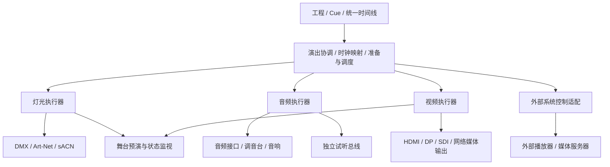

# 历史提案：内置音视频播放与输出（已被新边界替代）

归档日期：2026-09-11。用户最新明确：StageMaster 原则上不处理演出音频／视频，负责编排、外部控制和实时监听／监看。本文内置播放、混音、视频合成、正式媒体输出与 GStreamer 主播放后端等建议均不再是当前实施范围。请以[当前声光视频设计](audiovisual-stage-design.md)为准；以下仅保留决策历史。

日期：2026-09-10。状态：架构补充建议；当前没有音视频、舞台渲染或真实输出实现。本文不改变已确认的 Rust＋TypeScript 技术框架，也不表示新增媒体库已经选定。总体边界延续[架构设计 v0.3](architecture.md)。硬件适配范围和代次作用域按[变更风险审查](architecture-change-risk-review.md)修订。

## 1. 产品判断

StageMaster 应能编排一个包含灯光、音频、视频及外部设备动作的完整节目。专业灯光仍是当前主线；音视频作为独立模块接入统一的演出控制和时间模型。小型演出可由单机完成，复杂演出可以将视频或音频交给其他设备执行。

系统同时支持两种使用方式：自己播放素材并输出信号；调度外部媒体服务器／音频系统，读取其准备与播放状态。项目需明确每条轨道由谁执行，避免本机与外部设备重复播放。

图为逻辑职责。演出协调器传递计划、控制、时间映射和状态，不中转音频采样或视频大帧。灯光执行器保有自己的运行循环；音视频可先使用一个原生媒体工作进程，在内部按音频／视频分支运行，以便共享媒体时钟。两者即使位于同一进程，也必须限制队列、解码资源和背压影响。

独立媒体进程可隔离部分软件故障，不能消除 CPU、GPU、磁盘和系统驱动争用。大型输出可以部署到另一台机器；是否需要拆机由实测资源预算决定。

## 2. 如何模拟

这里把“模拟”首先定义为：没有舞台硬件时，在电脑里排练声光视频的整体节目。

| 层次 | 能做什么 | 验证边界 |
| --- | --- | --- |
| 逻辑模拟 | 虚拟时钟推进 Cue、Fade、效果和媒体事件；检查属性值、轨道路由与播放位置 | 验证节目语义，不要求渲染画面 |
| 2D／3D 联合预演 | 舞台、灯位、屏幕；显示灯光动作、颜色与屏幕内容，配合音频试听 | 检查编排、构图、运动与卡点 |
| 视觉效果预估 | 光束、Gobo、雾、投影、遮挡、屏幕发光、视点变化 | 需要灯具与场景数据、渲染算法和校准；不是默认就有实测照度准确性 |
| 物理／声学仿真 | 声场覆盖、混响、反射、声压、真实照度与色彩评估 | 另需测量和专业模型，可通过独立适配接入 |

轻量舞台预演建议先评估 Three.js，在 TypeScript／React 界面中共享桌面、平板和 Web 的视图代码。它提供聚光灯及视频纹理等基础能力，但完整舞台光束、Gobo、雾效与专业灯具模拟仍需开发。依据：[SpotLight](https://threejs.org/docs/pages/SpotLight.html)、[VideoTexture](https://threejs.org/docs/pages/VideoTexture.html)。

用户进一步指出 UE5 在专业预演上的价值，现将其作为专业预演的优先原型候选。专业 UE 后端与轻量客户端共享中立场景和已求值状态，通过独立接口准备资源、订阅并渲染；不重写节目规则。详见 [UE5 专业预演方向](ue5-professional-previsualization.md)，包括接口生命周期、同步、灯具校准与首个验证场景。当前未安装或接入 UE。

场景中的虚拟 LED 屏／投影面绑定逻辑 VideoSurfaceId，不绑定某个浏览器 video 元素。优先显示实际合成输出的降采样预览；离线可使用带准确时间映射的代理素材。需显示当前预览的来源、位置和延迟，不能把浏览器代理帧当成真实输出回执。

预演复用 Rust 求值结果与同一节目时钟，不在 Three.js 里再写 Cue 跟踪和效果规则。实际灯具动作可以按档案中的速度等信息逐步补充；初期需要标记理想动作与硬件响应的区别。

Preview 上下文无现场输出权限，音频进入独立试听总线。Live Monitor 只观察现场数据，不因为打开预演窗口而再播放一次节目音频。后续可增加离线预演视频导出，由虚拟时钟逐帧渲染；导出的画面也只代表对应的预演精度。

## 3. 音频怎样输出

基本链路：`音频素材 → 解码／预读 → 轨道与音量包络 → 混音总线 → 声道映射 → 音频设备 → 调音台／音响`。

首个可用实现需要音乐与音效轨、源素材入出点、Fade、增益、静音、循环、暂停与定位；执行设备的采样率、声道布局、缓冲和延迟必须可见。USB 音频接口是单机连接现场调音台的一条实际路线，具体设备与可用输出通道在适配时核实。

提前建模多个总线，例如 Main、Monitor、Click、Timecode；它们可映射到多通道接口的不同输出。试听、节拍提示与时间码不默认混入观众主扩；内嵌于视频文件的音轨也必须有唯一的启用与路由策略。初版不因此扩展成完整调音台、DAW 或插件宿主。

网络音频属于独立端点适配。Dante 等目标需要具体驱动／接口／协议支持，不能把“有网口”视作已经支持。优先经目标系统呈现的音频设备或明确 SDK 接口接入，不重新实现未经验证的专业网络音频协议。

## 4. 视频怎样输出

基本链路：`视频／图片／实时输入 → 解码或采集 → 时间戳帧 → 图层合成 → 逻辑画布／屏幕 → 校正与输出适配`。

| 输出方式 | 接入位置 | 设计要求 |
| --- | --- | --- |
| HDMI／DisplayPort | 原生媒体输出窗口 → 外接显示端 → LED 处理器／投影机等 | 独立于编辑 UI；固定逻辑屏幕与物理端点绑定，明确分辨率、刷新率与断连行为 |
| SDI | 专用输出硬件及驱动／SDK | 验证设备型号、视频制式、音频嵌入与时序；不假定普通 Mac 自带该接口 |
| 网络视频 | 独立媒体流适配器，如 NDI 候选 | 评估编码、带宽、延迟、接收端和 SDK；与 Web 控制 API 分开 |
| 外部媒体服务器 | 发送播放／定位／图层等控制命令 | 外部系统实际解码与输出；核查命令支持、反馈和时间同步能力 |

GStreamer 已有 DeckLink 视频输出插件，可以作为专业输出适配调查入口；它并不证明所有硬件组合都能工作。[官方插件文档](https://gstreamer.freedesktop.org/documentation/decklink/decklinkvideosink.html)

第一版建议先支持一条视频轨、图片、淡入淡出和一个独立外接画面。模型现在保留多轨、多图层、多个 Surface／输出、裁剪、缩放、映射与校正边界；完整投影融合、复杂映射及多路高分辨率输出后续按需实现。

LED 处理器最终完成其硬件像素映射。项目中的内容画布、虚拟舞台屏幕、实际视频端口是三种不同对象。不能把窗口序号或显示器枚举顺序存成永久屏幕身份；设备缺失时显示未配适状态，不能自动把演出画面搬到操作界面。

视频颜色需记录色彩空间、传递函数、范围、像素比例及 Alpha 策略；首期先约定受控的 SDR 输出配置，HDR、不同显示设备一致性和多屏校准另行验证。

外部控制可先以一个确有文档的系统验证：例如 Resolume 提供 OSC 控制及反馈入口。适配需绑定实际版本和地址，不能从“支持 OSC”推断所有播放器共享同一命令。[Resolume 官方 OSC 说明](https://resolume.com/support/en/osc)

## 5. 同步的核心设计

同一同步组内的时间线代表共同节目位置；音频、视频和灯光按各自节奏执行。音频按采样缓冲、视频按帧和显示时序、灯光按属性求值与端口刷新推进，不能强行把所有模块塞进同一个帧循环。

同时保留灯光师手动 Go、临时触发音效、背景视频独立循环和按节拍运行效果的工作方式。各同步组可有独立播放位置与主从关系，停止一段音乐不默认停止所有背景内容；关联 Cue 时再声明启动、跟随、释放和结束策略。统一的是时间类型、控制语义与可查询状态，不要求整场演出只能沿一条固定时间轴播放。

本机播放音乐时，优先验证音频设备时钟作为同步参考的方案。演出协调器保存媒体时钟与自身单调时间的映射；音视频内部的时钟由媒体后端协调。无音频输出时使用独立单调时钟；外部时间码进入单独的同步适配。主时钟失效时，按已配置策略切换／保持／停止，并产生新的时钟 epoch，不能随机选新设备后继续假装无缝。

GStreamer 使用时钟、缓冲时间戳与 Segment 同步流，并处理媒体延迟；其内部的 running-time 与素材位置 stream-time 有区别。StageMaster 需要正确映射自己的节目时间，不能直接混用这些数值。[官方时钟与同步说明](https://gstreamer.freedesktop.org/documentation/application-development/advanced/clocks.html)

例：希望音乐重拍、屏幕闪白和灯光亮起在节目 10 秒处对应。文件应提前打开、解码和预备，执行器按目标呈现时间调度；根据已测的音频、视频处理器与灯具响应延迟设置补偿。没有提前准备或设备不可调度时，应报告精度限制；无法提前预测的人工 Go 也不能补偿成尚未发生的动作。

跳时更新该同步组的 TransportGeneration，取消仅属于该组旧位置的待执行媒体与事件，再准备目标位置并确认；独立音乐、视频和灯光组不因此失效。静态灯光状态可以重算，视频可能需要从关键帧解码到目标位置。离散外部动作不自动补发。关键轨道未就绪时按同步组政策阻止开始或明确降级；不同输出无法获得真正的跨硬件事务原子性，回执应反映部分失败。已经交给硬件的旧缓冲未必可取消，需要适配器声明排空／切换能力。

多机需要共享时间参考、预先调度和状态对账；仅靠远程同时发送 Play 不够。大型拼接或需要帧起始对齐的系统还涉及 Genlock／帧锁及相应硬件能力；系统时钟一致不自动保证视频扫描时刻一致。[NDI 官方 Genlock 说明](https://docs.ndi.video/all/developing-with-ndi/advanced-sdk/genlock)

普通远程网页预览有网络与解码延迟，主要用于控制和观察，不作为现场是否精确同步的测量依据。

## 6. 可用框架与当前建议

| 路线 | 优点 | 我们仍需完成的工作 | 当前判断 |
| --- | --- | --- | --- |
| 浏览器音视频＋Three.js | 与现有 TS 界面共享，适合试听和舞台预演 | 平台媒体能力、时间映射、预览延迟；不把 UI 生命周期绑定到正式输出 | 用于客户端预演候选 |
| UE5 独立预演后端 | 已有 DMX 和舞台相关流程，可用于专业三维预演 | 中立场景映射、C++／蓝图适配、灯具功能与校准、时间映射、资源预算和分发 | 专业预演优先原型候选；现场视频输出另行评估 |
| Rust＋GStreamer | 已有媒体管线、同步和多种输入／输出插件，平台安装路径较完整 | Rust 封装、节目调度、输出窗口与路由、插件裁剪、发布与性能测试 | 原生音视频后端优先原型候选 |
| Rust＋FFmpeg 库＋自建音频／图像输出 | 解码／转换等组件可按需求组合，自主控制高 | 自行承担较多播放同步、缓冲、窗口、设备与恢复工作 | 保留为具体瓶颈出现后的备选 |

依据：[GStreamer 平台](https://gstreamer.freedesktop.org/documentation/installing/index.html)、[Rust 绑定入口](https://gstreamer.freedesktop.org/bindings/rust.html)、[FFmpeg 官方组件](https://www.ffmpeg.org/about.html)。如需要独立 Rust 音频 I/O，CPAL 可作为适配候选，但它不是完整媒体播放系统。[CPAL 项目](https://github.com/RustAudio/cpal)

暂不同时叠加多套通用解码／播放框架。采用原生媒体库仍会增加本地依赖体积；Rust 绑定不会让底层库消失。我们继续用 Rust＋TypeScript 编写业务，通过插件白名单与按目标构建减少分发内容，实测安装包、内存和启动开销后再定案。正式选型时按实际插件／构建配置核查许可证。

GStreamer 也不会自动提供我们的专业时间线、投影映射或舞台渲染；其线程与队列仍需设计。[官方线程模型](https://gstreamer.freedesktop.org/documentation/application-development/advanced/threads.html)。大帧不能经 Tauri JSON 消息逐帧搬运，正式输出留在原生媒体路径；UI 使用状态、缩略图或受控预览流，必要时研究原生纹理共享。

## 7. 要补入工程和发布模型的对象

- `MediaAsset`：内容哈希、原始文件、代理文件、时基、声道／颜色信息；相同文件的音视频轨能被分别引用。
- `MediaClip`：素材轨、源区间、节目起点、速度／循环、包络、路由；源时间与节目时间分开。
- `AudioBus / ChannelMap`：混音总线、监听与物理声道连接。
- `VideoLayer / Canvas / Surface`：内容合成、逻辑画布、舞台显示面与输出映射。
- `SyncGroup / ClockBinding`：同步参考、就绪门槛、延迟补偿和失效政策。
- `ExternalEndpoint`：外部执行者、能力、命令映射与真实反馈级别。

工程修订仍由编辑服务拥有；媒体执行器只持有准备好的计划与播放状态。执行状态报告资产、clip、位置、执行域及计划代次、同步组及播放代次、时钟映射、就绪／应用时间、欠载／丢帧与实际端点，不能只报告“播放中”。计划激活、Seek、时钟变化和端口所有权不共用一个全局 epoch。

控制命令、音频 PCM／视频帧、客户端预览流分别传输。媒体卡顿时灯光线程不等待它；节目政策可以选择继续、保持、静音／黑场或停止同步组，但这是明确的演出行为，不应由队列堵塞偶然决定。

云端分发同时包含音视频原素材、目标转码版本与预览代理的依赖关系。发布清单声明必需资源，完整下载和校验后准备；只存在缩略图或代理文件不能当作正式素材就绪。素材按目标能力选择，转码产物有独立哈希与参数版本；现场不依赖临时从云端读取关键媒体。

## 8. 建议实施与验收

第一步完成单机联合预演：一段音乐、一段视频、两个虚拟灯具和一个虚拟屏幕，能一起播放、暂停、定位和循环，观察音频位置、视频时间戳与灯光值。先验证语义与同步，未接设备时不声称真实输出达标。

第二步完成实际输出：一个音频接口、一个外接显示端和既定 DMX 接口；编辑窗口、试听、正式输出分别控制。测量端到端偏差、长期漂移、丢帧／欠载、设备重连，以及视频解码和 UI 压力对 DMX 的影响。

第三步扩展多轨／多屏和一个外部播放器适配，再考虑投影映射、SDI／网络媒体与独立媒体主机。能力和资源上限来自实测，不预承诺多路 4K、硬实时或帧级一致。

关键故障场景包括：视频素材缺失；有画面但音轨重复播放；音频设备重连改变声道映射；显示器拔出后枚举改变；Seek 后旧帧迟到；媒体进程崩溃；外部系统仅确认收到命令而未实际播放；云端下载中断。每项都需要明确状态、输出政策和恢复步骤。
