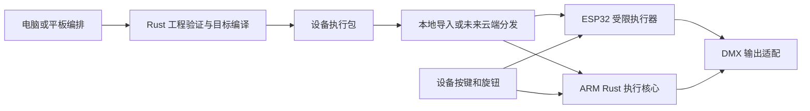

# 独立场景播放盒：ESP32 与 ARM 可行性

初稿：2026-09-11；首版范围更新：2026-09-21。用户明确的使用方式：提前编好工程，装入廉价设备；现场没有电脑时，在设备上选择不同场景播放。用户现已确认首次交付软件＋硬件，现有微雪 ESP32-S3-RS485-CAN，先做 1 路 DMX。当前优先级以[首版 ADR](development/decisions/PRODUCT-ADR-001-first-software-hardware-delivery.md)与[执行计划](development/execution-plan.md)为准；本文保留完整产品边界。已核对[板卡资料](hardware/waveshare-esp32-s3-rs485-can.md)，尚无固件、容量或物理输出实测。

## 1. 产品判断

**可以实现。首款低成本、功能明确的场景播放盒优先验证 ESP32；需要更多并发、复杂效果和集成时采用 ARM64 Linux。两者都应能本地保存并独立执行节目。**

独立播放盒拥有本地节目、播放状态、时钟和输出能力；电脑、手机、云端只负责导入、配置或发控制命令。关闭电脑、退出手机页面或断开云端后，已装载的本地灯光节目仍能继续。仅接收电脑逐帧数据并转发 DMX 的设备属于输出节点，不满足本次需求。

这里的 ARM 主选项指能运行 Linux 的 Cortex-A 类板卡；Cortex-M 等 ARM 微控制器属于另一类受限设备，不能因同为 ARM 就假定能装完整主机软件。ESP32 是芯片家族；现已选现有 S3 板作为首台样机，其他档位后续验证。

| 形态 | 能独立承担的工作（设计目标） | 主要限制 | 语言建议 |
| --- | --- | --- | --- |
| ESP32 播放盒 | 本地节目选择、场景选择／执行、渐变、循环、受支持效果、按键／旋钮触发、DMX 输出 | 指令集、并发、RAM、存储、输出路数均须声明和测量 | 优先验证 Rust 小型执行内核与固件；SDK 例外见第 4 节 |
| ARM64 Linux 播放盒 | 复用完整 Rust 执行核心，承载更多同时播放、复杂效果及外部系统控制 | 仍受 CPU、驱动、I/O、散热和存储约束，不等于无限容量 | Rust；有本地 Web 界面时复用 TS 前端 |
| 纯输出／控制面节点 | 收帧、物理发送、按键扫描、推子反馈 | 没有本地节目求值就不能自主播放 | Rust 或符合芯片 SDK 的 C／C++ |

“低成本”是产品取向，尚无整机 BOM 和报价。不能用开发板售价代表含电源、隔离接口、屏幕、连接器、外壳及生产测试的成品成本。

## 2. 用户操作和文件交付

建议操作为：

1. 在电脑编好工程，例如“迎宾”“开场”“演出”“结束”几组场景。
2. 点击“发送到播放盒”或“导出播放盒文件”，选择设备型号／能力档案和需要的节目。
3. 软件自动检查效果、配适、输出和资源，生成适配文件并传输；不能播放的内容必须指出具体场景和原因。
4. 盒子完整校验、装载后，屏幕显示节目名、场景名称、当前播放及待选场景。
5. 现场转旋钮选择，按执行执行；下一条、释放、循环和总电平通过明确控制操作实现。选中一条本身不立即改变输出，直接触发按键可另行配置。

流程是“编好 → 导入 → 选场景播放”，用户不必手动理解编译器。但可编辑工程与设备执行文件应继续分开：

| 文件 | 内容 | 谁读取 |
| --- | --- | --- |
| 可编辑工程包 | 工程对象、可编辑关系及所需资源 | 桌面／平板编辑器；具备编译服务的 ARM 设备可选支持 |
| 设备执行包 | 兼容的执行计划、场景菜单和稳定 ID、依赖、配适／绑定要求、版本、摘要与来源认证 | 对应能力的播放盒 |

不能承诺把任意原始工程直接复制到 ESP32，就能现场解析全部专业控台功能。若要求 ARM 也接受原始工程，需要额外装入同一 Rust 编译／验证模块，加载准备在播放循环之外进行；这不是基础播放盒的必需功能。执行包可以保持一个用户可见文件，不要求用户管理内部清单。

首版先实现 USB 本地导入与控制；USB 外设和传输协议仍需固件验证，不表示支持 U 盘主机或把设备当移动磁盘。局域网、可移动存储与未来云端分发复用执行包与校验／激活流程，云端不是现场播放的前置条件。

## 3. ESP32 能承担业务，但必须控制执行范围

首个档位建议围绕以下语义验证：一个活动节目、可选择的场景列表、渐变／延时、有限循环、明确支持的基础效果、总电平及释放。一个活动节目不等于只能保存一个节目；切换节目要重新准备，禁止混用两份配适。多个并行播放通道、复杂多步动态效果／空间效果与动态外部输入后续按能力加入。

**任意选场景不能只是读取一张 DMX 静态截图。** 编译时需要解析该场景依赖的跟踪、预设、配适及效果参数；切换时还要定义从当前输出过渡、释放未使用属性、效果相位重启／延续和多次按执行的行为。只导出选中场景而漏掉前置跟踪值会产生错误画面。目标可以用预解析状态和有界效果操作减少工作，但必须保持声明支持的语义。

超出能力的节目有三个明确结果：拒绝导出并定位问题；用户选择可审阅的简化版本；改用 ARM 播放盒。不能暗中删效果，也不能让 ESP32 的限制反向限制桌面工程。

ESP32-S3-WROOM-2 官方资料列出双核 Xtensa LX7、最高 240 MHz、512 KB 内部 SRAM，并有不同外部 Flash／PSRAM 配置。这是特定系列参考，不能把内部 SRAM 当成全部可用业务内存，也不能把某个模组的容量套用到所有 ESP32。[模组资料](https://documentation.espressif.com/esp32-s3-wroom-2_datasheet_en.html)

PSRAM 有价值，但不能仅靠增加 PSRAM 推断实时性。ESP-IDF 文档列出缓存关闭时外部 RAM 不可访问、DMA 描述符位置和带宽等限制，也说明特定 XiP 配置可避免某些 Flash 操作关闭缓存。需要按最终配置安排代码、栈和缓冲位置，并验证网络与 Flash 写入的干扰。[ESP32-S3 外部 RAM](https://docs.espressif.com/projects/esp-idf/en/stable/esp32s3/api-guides/external-ram.html)

不把逐帧录制当作唯一执行格式。以一个输出域的 512 字节通道负载、假设每秒保存 40 帧为例，未压缩一小时为 `512 × 40 × 3600 = 73,728,000` 字节，约 73.7 MB，尚未含索引等开销。这只是存储算例，不是协议刷新要求或容量测量。预编译渐变／效果通常能避免逐帧存储；录制轨道可作为受限模式，但存储、随机跳转和实时干预能力须单独声明。

## 4. 语言与框架选择

主工程语义与编译器继续采用 Rust。ARM Linux 播放程序也采用 Rust；`aarch64-unknown-linux-gnu` 是 Rust Tier 1 目标，但语言目标支持不代表任意主板的驱动和厂商 SDK 都可直接使用。[Rust ARM64 Linux 支持](https://doc.rust-lang.org/rustc/platform-support/aarch64-unknown-linux-gnu.html)

ESP32 先验证 Rust 路线，以复用小型执行算法并减少主要维护语言；具体固件框架在现有 S3 板上验证：

| 路线 | 价值 | 本项目处理 |
| --- | --- | --- |
| Rust `no_std`＋`esp-hal` 生态 | 不依赖完整标准库，适合有界执行器；可共享纯算法模块 | 首选验证候选；逐项核实 UART、存储、网络、更新与驱动稳定性，不把 `no_std` 等同于无需调度或没有分配 |
| Rust＋ESP-IDF 绑定 | 借用 ESP-IDF 的网络、存储、OTA 等服务 | 有价值的备选；核实所需 IDF 版本及绑定维护成本，不能当作完整 Linux 环境 |
| C／C++＋ESP-IDF | 直接接入厂商 SDK，部分驱动集成更直接 | 只有具体驱动／维护需求证明有收益时采用；限定于固件宿主或适配层，C++ 标准随 SDK 验证，不强制 C++26 |

当前官方 Rust 生态资料以 `esp-hal` 为核心，要求按芯片检查外设与稳定性；网络还依赖相应运行支持。`esp-idf-svc` 自身说明其绑定属于社区维护，可能落后于 ESP-IDF，缺少硬件在环测试；因此不能笼统宣称所有“ESP Rust”路线都有相同官方支持。[Espressif Rust 生态](https://docs.espressif.com/projects/rust/book/introduction/ancillary-crates.html)、[ESP-IDF Rust 绑定维护说明](https://github.com/esp-rs/esp-idf-svc)

ESP32／S2／S3 的 Xtensa 当前需要专用 Rust 编译器分支；部分 RISC-V 型号可使用上游工具链。芯片还要按 RAM、外设、供货和整机需求比较，不能只按指令集选择。即使外层换成 C，只要内部仍包含 Rust，相关 Rust 目标工具链依然需要。[工具链说明](https://docs.espressif.com/projects/rust/book/getting-started/toolchain.html)

如特定 Rust 目标无法满足交付要求，先评估其他芯片或 ARM 档位。真正改成 C／C++ 小型执行器是新的实现决策，必须以同一执行语义与样例验收，不能悄悄复制一套场景规则。

设备执行侧不需要 TS 引擎、Node.js、Fastify 或 PostgreSQL。手机／浏览器控制页面可复用 TS；设备提供必要控制接口，浏览器运行界面。语言数量与最终体积没有简单正比关系，SDK、媒体库、运行时及依赖裁剪更需要实际构建测量。

## 5. 复用边界与模块责任

图中执行包是文件类别，不保证 ESP32 与 ARM 使用相同计划产物。两者复用源工程、编译语义和共同执行算法；面向各档位生成匹配的计划。手机或云端也可发控制命令，播放状态始终归现场设备所有。

| 模块／调用意图 | 输入输出与职责 | 应避免的耦合 |
| --- | --- | --- |
| 目标能力查询 | 固件／执行格式版本、支持操作、端口、时钟和资源限额 | 仅返回“支持 DMX”布尔值 |
| 验证与编译 | 工程修订＋能力档案＋绑定要求 → 计划、场景目录和兼容报告 | 固件解析全部编辑器对象；云端另写语义 |
| 包存储与准备 | 暂存、校验、解析有界数据、预留内存 → 可激活句柄 | 边下载边覆盖正在运行文件 |
| 播放控制 | `selectCue` 只改待选项；`go`／`gotoCue`／`release` 经权威状态机执行 | 按键直接修改 DMX 缓冲；重连重放旧执行 |
| 小型执行内核 | 已验证计划＋单调时间＋有序输入 → 有界输出和状态 | 网络、文件、UI、数据库进入执行周期 |
| 输出与平台适配 | 数值帧到端口；时钟、存储、看门狗和启动生命周期 | 编译器依赖 ESP32 引脚或 Linux 设备路径 |

这些是责任与调用语义草案，不是已实现接口。沿用伪 API 0.3 的执行域、计划代次、请求身份及租约边界；能力档案、离线导出配置和计划载荷的精确定义仍待原型，不声称现有 TS 声明已覆盖所有固件接口。MCU 不需要装入完整 `StageClient` 的服务集合。

新增硬件时，平台适配通常需要改变；若硬件承载的是受限档位，还必须选择相应的编译后端和执行子集。不能承诺任何主板都只换一个驱动就运行完整核心。

代码上优先提取小而稳定的 Rust 数值、插值、合成及计划执行算法，使它们能在有界内存中运行；主机完整执行器复用这些模块。工程编辑、复杂编译、诊断追踪和存储不必全部改成 `no_std`。当前 `stagemaster-engine` 使用 `std::collections::BTreeMap` 和逐属性 `Vec` 追踪，仍是静态原型；把 `std` 换成 `alloc` 不会自动解决容量和实时性，没有现成的 MCU 核心可以直接刷入。

## 6. 独立播放必须闭合的行为

- **本地启动与操作：** 已安装节目不依赖云端登录或网络启动；本地控制权由设备维护。屏幕区分选中、已接受、正在播放和输出故障，按钮不是仅发命令不读状态。
- **时间与同步：** 渐变／效果使用单调时间。定时营业等日历触发另需有效墙钟及 RTC／校时策略；多个断网盒子不能只凭相同节目或同时上电就承诺长期同步。外部音视频同步依赖仍须显式声明。
- **断网与依赖：** 本地灯光继续按既定策略执行；依赖外部音视频播放器的动作仍要求外部设备可达。“不用电脑”不等于把音乐和视频自动变成盒子内部播放；这仍遵守项目的外部音视频边界。
- **供电与恢复：** 保存已安装包及明确的恢复策略，不逐帧写 Flash。重启后不得无条件重放历史执行或危险设备触发；选择待机、指定恢复场景或经验证的续播方式。灯光熄灯不等同于所有设备通道归零。
- **交付与更新：** 执行包至少区分暂存、校验／准备、当前活动及可回退版本；掉电后能识别完整包。程序固件 OTA 与节目包更新分开，固件回滚不自动替节目数据提供事务保护，也要检查旧固件与现用节目兼容。
- **资源竞争：** 演出期间限制 Flash 擦写和大批量日志；未经压力验证，更新工作安排在待机。RAM 同时容纳不了新旧计划时，设备应要求停止后切换，不能宣称可无缝热更新。
- **输出时序：** UART、缓冲、定时与 RS485 收发器协作产生信号，按真实接口测量。普通 Linux 和 MCU 都需验证调度及 I/O 干扰；有需要时 ARM 可外接独立输出 MCU，但不预设每台盒子必须两块板。

ESP-IDF 的 UART 文档提供 RS485 接口模式及外部收发器电路，它不是成品 DMX 合规或稳定性证明；实际 DMX Break、MAB、帧间隔和方向切换仍要验证。[ESP32-S3 UART／RS485](https://docs.espressif.com/projects/esp-idf/en/stable/esp32s3/api-reference/peripherals/uart.html)

ESP-IDF 应用 OTA 支持分区和回滚机制，但文档明确区分应用与其他分区的更新风险；节目文件需自行设计一致性。Linux PREEMPT_RT 改变抢占及调度行为，也不替代整机时序测试。[ESP-IDF OTA](https://docs.espressif.com/projects/esp-idf/en/stable/esp32s3/api-reference/system/ota.html)、[Linux 实时机制](https://docs.kernel.org/core-api/real-time/theory.html)

## 7. 最小原型与验收

硬件已进入首次交付范围。先让桌面以虚拟时钟运行同一受限计划，并尽早用现有微雪 S3 板验证工具链与输出风险；再贯通独立播放与软件。需要复杂能力时追加 ARM64 实机，而非立即维护两款完整产品。

首版已确认只接一路物理 DMX，测试多个场景、任意跳转、渐变、顺序循环和本地选场景／执行；更复杂效果按能力档案另行加入。一路是本次范围，不是芯片的最大路数；场景数、包大小和执行容量仍须测量后公布。

| 验收 | 应看到的结果 |
| --- | --- |
| 导入后电脑关机、网络断开 | 本地选场景、执行、渐变和循环仍工作 |
| 跳到带跟踪／预设依赖的场景 | 与同语义桌面参考结果一致，不漏继承值 |
| 渐变中再选场景／连续执行／释放 | 行为符合明确定义，选择与播放分离，无旧命令重复执行 |
| 超限／未知操作／不兼容版本 | 装载前指出原因，旧节目保持可用 |
| 下载／提交／重启过程中掉电 | 不装载半个节目，按恢复策略进入可诊断状态 |
| 网络、按键、屏幕与存储施压 | 记录执行周期最大耗时、超时、内部 RAM 余量及真实输出间隔；边界不达标就降档或换硬件 |
| 持续运行与重启 | 无持续内存增长，状态和故障可观察；看门狗复位后的输出符合恢复策略 |

设备档案最后根据这些测量公布最大属性数、并发播放通道／效果、队列长度、计划大小、端口和刷新条件。CPU 频率、可用 PSRAM 或“能发 DMX”都不能单独推算可带多少灯。
